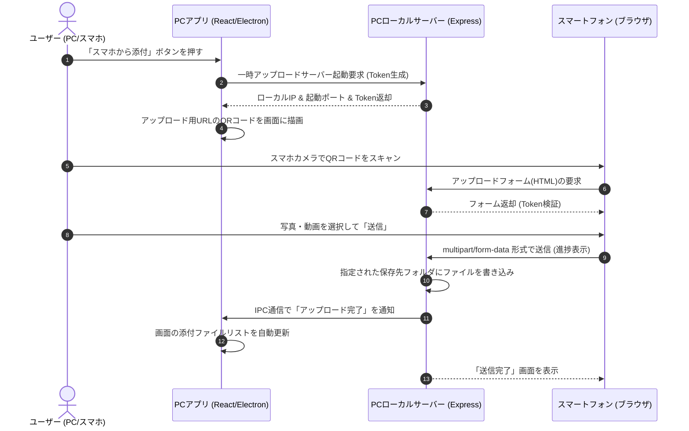

# 📲 ローカルWi-Fi経由のスマホ写真・動画アップロード機能（QRコード連携）共通スキル

本ドキュメントは、PCデスクトップアプリ（Electron等）とスマートフォン（iPhone/Android）をローカルWi-Fiで接続し、QRコードを用いて写真や動画を簡単・セキュアに直接PCへアップロードする機能の設計・実装コードをまとめた汎用スキルファイルです。

他プロジェクトや新規 AI アシスタントに対して、「このスキルファイルを読み込んで実装して」と指示することで、即座に同一の仕組みを再現できます。

---

## 1. システム概要と処理の流れ (System Architecture)

外部のクラウドサーバー（AWS、GCP等）を経由せず、ローカルネットワーク（LAN）内で通信を完結させるため、情報漏洩のリスクが極めて低く、高速かつ容量制限の少ない転送が可能です。

### 🔄 処理シーケンス



---

## 2. メインプロセス実装 (Node.js / Express / Multer)

ローカルIPアドレスの動的取得、Expressによるサーバー起動、および `multer` を用いたファイル受信処理を行います。

### 2.1 ローカルIPアドレスの取得
同一Wi-Fi内のスマホがPCに接続するため、PCのプライベートIPアドレス（`192.168.xx.xx` 等）を動的に特定します。

```typescript
import os from 'os';

function getLocalIpAddress(): string {
  const interfaces = os.networkInterfaces();
  for (const name of Object.keys(interfaces)) {
    for (const iface of interfaces[name] || []) {
      // IPv4 かつ ループバック(127.0.0.1)でないものを探す
      if (iface.family === 'IPv4' && !iface.internal) {
        if (
          iface.address.startsWith('192.168.') || 
          iface.address.startsWith('10.') || 
          iface.address.startsWith('172.')
        ) {
          return iface.address;
        }
      }
    }
  }
  return '127.0.0.1'; // フォールバック
}
```

### 2.2 Expressサーバーの起動とアップロード受付
特定のレコード（保存先パス）と紐づいた一時的なトークンを生成し、マルチパートアップロードを受け付けます。

```typescript
import express from 'express';
import multer from 'multer';
import path from 'path';
import http from 'http';
import fs from 'fs';

let uploadServer: http.Server | null = null;
let currentUploadToken: string | null = null;

// サーバー停止処理
export function stopServer(): void {
  if (uploadServer) {
    uploadServer.close();
    uploadServer = null;
    currentUploadToken = null;
    console.log('[Upload Server] Stopped.');
  }
}

// サーバー起動処理
export function startServer(
  patientId: number, 
  recordId: number, 
  token: string, 
  userDataDir: string,
  onUploadSuccess: () => void
): Promise<{ ip: string; port: number }> {
  
  stopServer();
  currentUploadToken = token;

  const port = 3010; // 任意の固定ポートまたは空きポート
  const ip = getLocalIpAddress();
  const app = express();

  // 保存先フォルダの作成
  const uploadDir = path.join(userDataDir, 'attachments', String(patientId), String(recordId));
  if (!fs.existsSync(uploadDir)) {
    fs.mkdirSync(uploadDir, { recursive: true });
  }

  // Multerの設定 (ファイル名の衝突を防ぐためタイムスタンプを付与)
  const storage = multer.diskStorage({
    destination: (_req, _file, cb) => cb(null, uploadDir),
    filename: (_req, file, cb) => {
      const uniqueSuffix = Date.now() + '-' + Math.round(Math.random() * 1e9);
      const ext = path.extname(file.originalname);
      cb(null, `attachment_${uniqueSuffix}${ext}`);
    }
  });

  const upload = multer({
    storage,
    limits: { fileSize: 300 * 1024 * 1024 } // 300MB制限 (動画を想定)
  });

  // 1. トークン検証ミドルウェア
  const verifyToken = (req: express.Request, res: express.Response, next: express.NextFunction) => {
    const tokenParam = req.query.token || req.body.token;
    if (!currentUploadToken || tokenParam !== currentUploadToken) {
      res.status(403).send('<h1>エラー: セッションの有効期限が切れています。QRコードを再スキャンしてください。</h1>');
      return;
    }
    next();
  };

  // 2. スマホへアップロードUI(HTML)を返却するルート
  app.get('/upload', verifyToken, (req, res) => {
    const htmlPath = path.join(__dirname, 'upload_form.html'); // または文字列として直接インライン埋め込み
    // トークンをフォーム内に動的に埋め込んでHTMLを返却
    let html = getMobileHtmlTemplate(); 
    html = html.replace('__TOKEN__', String(currentUploadToken));
    html = html.replace('__PATIENT_ID__', String(patientId));
    html = html.replace('__RECORD_ID__', String(recordId));
    res.send(html);
  });

  // 3. アップロードAPIの受付
  app.post('/api/upload', verifyToken, upload.array('attachments', 10), (req, res) => {
    try {
      const files = req.files as Express.Multer.File[];
      if (!files || files.length === 0) {
        res.status(400).json({ success: false, error: 'ファイルが選択されていません。' });
        return;
      }

      // データベース登録処理やメタデータ保存をここで行う
      // 例: DBに挿入するデータを整理して保存
      
      // レンダラープロセス等へ完了を通知 (IPC通信)
      onUploadSuccess();

      res.json({ success: true });
    } catch (err: any) {
      res.status(500).json({ success: false, error: err.message });
    }
  });

  return new Promise((resolve, reject) => {
    uploadServer = app.listen(port, '0.0.0.0', () => { // '0.0.0.0' で外部接続を許可
      console.log(`[Upload Server] Started on http://${ip}:${port}`);
      resolve({ ip, port });
    });
    uploadServer.on('error', (err) => reject(err));
  });
}
```

---

## 3. スマートフォン用アップロードUI (HTML / CSS / Vanilla JS)

スマートフォン側はアプリ等のインストールを不要にするため、標準ブラウザで軽快に動作するHTML単体（デザインはモダンで直感的なもの）をサーバーからレスポンスします。

```html
function getMobileHtmlTemplate() {
  return `
  <!DOCTYPE html>
  <html lang="ja">
  <head>
    <meta charset="UTF-8">
    <meta name="viewport" content="width=device-width, initial-scale=1.0, maximum-scale=1.0, user-scalable=no">
    <title>ファイルアップロード | 写真・動画連携</title>
    <style>
      :root {
        --color-primary: #3b82f6;
        --color-primary-dark: #2563eb;
        --color-bg: #f8fafc;
        --color-card: #ffffff;
        --color-text: #1e293b;
        --color-text-light: #64748b;
        --color-border: #e2e8f0;
      }
      * { box-sizing: border-box; margin: 0; padding: 0; }
      body {
        font-family: -apple-system, BlinkMacSystemFont, "Segoe UI", Roboto, sans-serif;
        background-color: var(--color-bg);
        color: var(--color-text);
        line-height: 1.5;
        padding: 16px;
      }
      .container {
        max-width: 480px;
        margin: 0 auto;
        background: var(--color-card);
        border-radius: 16px;
        padding: 24px;
        box-shadow: 0 4px 6px -1px rgba(0, 0, 0, 0.05), 0 2px 4px -1px rgba(0, 0, 0, 0.03);
      }
      h2 { font-size: 20px; font-weight: 700; margin-bottom: 8px; text-align: center; }
      p.subtitle { color: var(--color-text-light); font-size: 13px; text-align: center; margin-bottom: 24px; }
      
      .dropzone {
        border: 2px dashed var(--color-border);
        border-radius: 12px;
        padding: 32px 16px;
        text-align: center;
        cursor: pointer;
        transition: all 0.2s ease;
        background-color: #fcfdfe;
      }
      .dropzone:active, .dropzone.dragover {
        border-color: var(--color-primary);
        background-color: #eff6ff;
      }
      .dropzone-icon { font-size: 40px; margin-bottom: 12px; display: block; }
      .dropzone-text { font-size: 14px; font-weight: 600; color: var(--color-text); }
      .dropzone-subtext { font-size: 12px; color: var(--color-text-light); margin-top: 4px; }
      
      #file-input { display: none; }
      
      /* ファイル選択リスト */
      .file-list { margin-top: 20px; max-height: 200px; overflow-y: auto; }
      .file-item {
        display: flex;
        justify-content: space-between;
        align-items: center;
        padding: 8px 12px;
        background: #f1f5f9;
        border-radius: 8px;
        margin-bottom: 8px;
        font-size: 13px;
      }
      .file-name {
        overflow: hidden;
        text-overflow: ellipsis;
        white-space: nowrap;
        max-width: 80%;
      }
      .file-remove { color: #ef4444; font-weight: bold; cursor: pointer; padding: 0 4px; }

      /* プログレスバー */
      .progress-container { display: none; margin-top: 20px; }
      .progress-bar-bg { background: var(--color-border); height: 8px; border-radius: 4px; overflow: hidden; }
      .progress-bar-fill { background: var(--color-primary); width: 0%; height: 100%; transition: width 0.1s linear; }
      .progress-text { text-align: center; font-size: 12px; color: var(--color-text-light); margin-top: 6px; }

      .btn {
        display: block;
        width: 100%;
        padding: 14px;
        background: var(--color-primary);
        color: white;
        border: none;
        border-radius: 8px;
        font-size: 15px;
        font-weight: 700;
        cursor: pointer;
        margin-top: 24px;
        transition: background-color 0.2s;
        text-align: center;
      }
      .btn:disabled { background: #cbd5e1; cursor: not-allowed; }
      
      /* 結果表示 */
      .result-view { display: none; text-align: center; padding: 32px 16px; }
      .result-icon { font-size: 48px; color: #10b981; margin-bottom: 16px; }
      .result-title { font-size: 18px; font-weight: 700; margin-bottom: 8px; }
    </style>
  </head>
  <body>
    <div class="container" id="main-container">
      <h2>📷 ファイルアップロード</h2>
      <p class="subtitle">PCアプリケーションに写真・動画を直接送信します。</p>
      
      <form id="upload-form">
        <input type="hidden" name="token" value="__TOKEN__">
        <input type="file" id="file-input" name="attachments" accept="image/*,video/*" multiple>
        
        <div class="dropzone" onclick="document.getElementById('file-input').click()">
          <span class="dropzone-icon">📤</span>
          <span class="dropzone-text">タップして写真・動画を選択</span>
          <span class="dropzone-subtext">(複数選択・動画も可、1ファイル最大300MB)</span>
        </div>

        <div class="file-list" id="file-list"></div>

        <div class="progress-container" id="progress-container">
          <div class="progress-bar-bg">
            <div class="progress-bar-fill" id="progress-bar-fill"></div>
          </div>
          <div class="progress-text" id="progress-text">準備中...</div>
        </div>

        <button type="submit" class="btn" id="submit-btn" disabled>送信を開始する</button>
      </form>
    </div>

    <div class="container result-view" id="success-container">
      <div class="result-icon">✅</div>
      <div class="result-title">送信が完了しました！</div>
      <p style="color: var(--color-text-light); font-size: 14px;">PC側のアプリケーション画面を確認してください。<br>このブラウザタブは閉じていただいて構いません。</p>
    </div>

    <script>
      const fileInput = document.getElementById('file-input');
      const fileList = document.getElementById('file-list');
      const submitBtn = document.getElementById('submit-btn');
      const uploadForm = document.getElementById('upload-form');
      const mainContainer = document.getElementById('main-container');
      const successContainer = document.getElementById('success-container');
      const progressContainer = document.getElementById('progress-container');
      const progressBarFill = document.getElementById('progress-bar-fill');
      const progressText = document.getElementById('progress-text');

      let selectedFiles = [];

      fileInput.addEventListener('change', (e) => {
        selectedFiles = Array.from(e.target.files);
        updateFileList();
      });

      function updateFileList() {
        fileList.innerHTML = '';
        if (selectedFiles.length === 0) {
          submitBtn.disabled = true;
          return;
        }
        submitBtn.disabled = false;
        
        selectedFiles.forEach((file, index) => {
          const item = document.createElement('div');
          item.className = 'file-item';
          
          const nameSpan = document.createElement('span');
          nameSpan.className = 'file-name';
          const sizeMB = (file.size / (1024 * 1024)).toFixed(1);
          nameSpan.textContent = file.name + ' (' + sizeMB + 'MB)';
          
          const removeSpan = document.createElement('span');
          removeSpan.className = 'file-remove';
          removeSpan.textContent = '✕';
          removeSpan.onclick = (e) => {
            e.stopPropagation();
            selectedFiles.splice(index, 1);
            // 同期をとる
            const dt = new DataTransfer();
            selectedFiles.forEach(f => dt.items.add(f));
            fileInput.files = dt.files;
            updateFileList();
          };

          item.appendChild(nameSpan);
          item.appendChild(removeSpan);
          fileList.appendChild(item);
        });
      }

      uploadForm.addEventListener('submit', (e) => {
        e.preventDefault();
        if (selectedFiles.length === 0) return;

        submitBtn.disabled = true;
        progressContainer.style.display = 'block';

        const formData = new FormData(uploadForm);
        // 重複防止のため手動で詰め直す
        formData.delete('attachments');
        selectedFiles.forEach(file => {
          formData.append('attachments', file);
        });

        const xhr = new XMLHttpRequest();
        xhr.open('POST', '/api/upload?token=__TOKEN__', true);

        // 送信進捗の監視
        xhr.upload.addEventListener('progress', (event) => {
          if (event.lengthComputable) {
            const percentComplete = Math.round((event.loaded / event.total) * 100);
            progressBarFill.style.width = percentComplete + '%';
            progressText.textContent = '送信中: ' + percentComplete + '% (' + (event.loaded / (1024*1024)).toFixed(1) + 'MB / ' + (event.total / (1024*1024)).toFixed(1) + 'MB)';
          }
        });

        xhr.onload = () => {
          if (xhr.status === 200) {
            const response = JSON.parse(xhr.responseText);
            if (response.success) {
              mainContainer.style.display = 'none';
              successContainer.style.display = 'block';
            } else {
              alert('アップロード失敗: ' + (response.error || '不明なエラー'));
              resetProgress();
            }
          } else {
            alert('通信エラーが発生しました (ステータス: ' + xhr.status + ')');
            resetProgress();
          }
        };

        xhr.onerror = () => {
          alert('アップロード中に接続エラーが発生しました。Wi-Fi接続を確認してください。');
          resetProgress();
        };

        xhr.send(formData);
      });

      function resetProgress() {
        submitBtn.disabled = false;
        progressContainer.style.display = 'none';
        progressBarFill.style.width = '0%';
        progressText.textContent = '準備中...';
      }
    </script>
  </body>
  </html>
  `;
}
```

---

## 4. レンダラープロセス（React）でのQRコードの生成・表示

フロントエンド側では、サーバーから受け取った IP・ポート・トークンを元にURLを組み立て、QRコードを表示します。また、完了のシグナルを受け取ったら表示リストを自動更新します。

### 4.1 インストール
QRコード生成ライブラリ `qrcode`（React/JS向け）を使用します。
```bash
npm install qrcode
npm install --save-dev @types/qrcode
```

### 4.2 Reactコンポーネント (Modal/Uploader)

```tsx
import React, { useEffect, useState } from 'react';
import QRCode from 'qrcode';

interface QRUploadModalProps {
  patientId: number;
  recordId: number;
  onClose: () => void;
  onUploadSuccess: () => void; // 完了時に親のリストを再読込
}

export const QRUploadModal: React.FC<QRUploadModalProps> = ({
  patientId,
  recordId,
  onClose,
  onUploadSuccess
}) => {
  const [qrUrl, setQrUrl] = useState<string>('');
  const [serverInfo, setServerInfo] = useState<{ ip: string; port: number } | null>(null);
  const [errorMsg, setErrorMsg] = useState<string>('');

  useEffect(() => {
    let active = true;
    const token = Math.random().toString(36).substring(2, 15);

    // 1. メインプロセスにアップロードサーバーの起動を要求
    window.api.startUploadServer(patientId, recordId, token)
      .then(async (info: { ip: string; port: number; success: boolean; error?: string }) => {
        if (!active) return;
        if (!info.success) {
          setErrorMsg(info.error || 'サーバーの起動に失敗しました。');
          return;
        }

        setServerInfo({ ip: info.ip, port: info.port });

        // 2. スマホがアクセスするURLを生成
        const targetUrl = `http://${info.ip}:${info.port}/upload?token=${token}`;
        
        // 3. URLをQRコードのデータURL(Base64イメージ)に変換
        const qrDataUrl = await QRCode.toDataURL(targetUrl, {
          width: 200,
          margin: 2,
          color: {
            dark: '#0f172a', // 暗い紺色
            light: '#ffffff'
          }
        });
        setQrUrl(qrDataUrl);
      })
      .catch((err) => {
        if (active) setErrorMsg('接続エラーが発生しました: ' + err.message);
      });

    // 4. メインプロセスからのアップロード完了通知（IPC）を購読
    const unsubscribe = window.api.onUploadComplete(() => {
      onUploadSuccess();
      onClose(); // 送信完了したら自動でモーダルを閉じる
    });

    return () => {
      active = false;
      unsubscribe();
      // モーダルを閉じたらポートを開放するためにサーバーを即座に停止する
      window.api.stopUploadServer();
    };
  }, [patientId, recordId]);

  return (
    <div className="modal-backdrop">
      <div className="modal-content" style={{ textAlign: 'center', padding: '24px' }}>
        <h3>📱 スマートフォンから写真・動画を追加</h3>
        <p style={{ fontSize: '13px', color: '#64748b', margin: '8px 0 16px' }}>
          PCと同じWi-Fiにスマホを接続し、カメラで以下のQRコードをスキャンしてください。
        </p>

        {errorMsg ? (
          <div style={{ color: '#ef4444', margin: '20px 0' }}>⚠️ {errorMsg}</div>
        ) : qrUrl ? (
          <div style={{ margin: '16px auto', display: 'inline-block', border: '1px solid #e2e8f0', borderRadius: '12px', padding: '12px', background: '#fff' }}>
            
          </div>
        ) : (
          <div style={{ margin: '40px 0' }}>接続準備中...</div>
        )}

        {serverInfo && (
          <div style={{ fontSize: '11px', color: '#94a3b8', marginTop: '8px' }}>
            接続先アドレス: http://{serverInfo.ip}:{serverInfo.port}
          </div>
        )}

        <div style={{ marginTop: '24px' }}>
          <button className="btn btn-secondary" onClick={onClose}>
            閉じる
          </button>
        </div>
      </div>
    </div>
  );
};
```

---

## 5. セキュリティとトラブルシューティング (Security & Troubleshooting)

### 5.1 セキュリティ対策
- **使い捨て型トークン (Temporary Token)**:
  - サーバーの起動要求の都度、ランダムな文字列（トークン）を生成し、QRコードとExpressセッションで紐づけます。
  - スマホ側がアップロードフォームにアクセスする際、およびマルチパートファイルをポストする際にこのトークンを厳しく照合し、同じWi-Fi内の無関係な第三者による誤挿入や妨害を防ぎます。
- **自動シャットダウン (Immediate Stop)**:
  - アップロードが1件完了する、またはPC上で「閉じる」ボタンが押された瞬間に、ポートの待機ポートをクローズしてサーバーを即座に停止させます。これにより、PCが不要にネットワークにポートをさらし続けるのを防止します。

### 5.2 トラブルシューティングチェックリスト
- **QRコードをスキャンしてもスマホで画面が開かない場合**:
  - **チェック 1**: スマホがWi-Fiではなくキャリア通信（4G/5G）になっていないか確認してください。
  - **チェック 2**: Wi-Fiルーターの設定で「プライバシーセパレーター」や「AP分離（異なる端末間同士の通信を遮断する機能）」が有効になっていないか確認してください（家庭用・オフィス用ルーターに多く、これが有効だとローカルIP間の通信が遮断されます）。
  - **チェック 3**: PCのOS（Windows DefenderやmacOSセキュリティ）が外部の接続をブロックしていないか確認してください。
